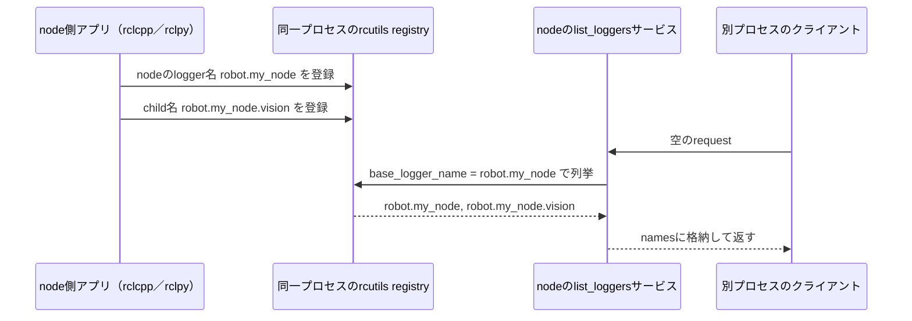

# logger名の登録・列挙機能の実装概要

loggerの生成時に名前を記録し、nodeの`list_loggers`サービスからその一覧を取得できるようにした。
これにより、一度もログを出していないchild loggerも名前で発見し、既存のサービスでレベルを取得・変更できる。

当初の計画の①〜④が実装済みで、⑤の`ros2 log describe`への組み込みは今後の作業である。
この文書は、`feature/logger-registry`の実装コミット`8bd8cee`を対象とする（2026-10-09作成）。

## 追加した機能と既存機能の関係

既存の`get_logger_levels`／`set_logger_levels`サービスは、requestに指定したlogger名を使ってレベルを取得・変更する。
child loggerも、その名前が分かっていれば操作できる。今回追加したのは、その前段となる名前の登録・列挙である。

rcutilsには以前から「logger名と、明示的に設定したレベル」の対応表があった。
ただし、レベルを設定していないloggerはこの表に含まれないため、生成されたloggerの一覧には使えない。
そこで、レベルの対応表とは別に、登録された名前を保持するregistryを追加した。

## 各パッケージの変更

| 変更先 | 追加・変更した内容 | 計画との対応 |
| --- | --- | --- |
| `rcutils` | プロセス内のlogger名を保持するregistryと、登録・列挙用のC API | ① |
| `rcl_interfaces` | 空のrequestと名前一覧のresponseを持つ`ListLoggers.srv` | ② |
| `rclcpp` | logger生成時の自動登録と、nodeの`list_loggers`サービス | ③・④ |
| `rclpy` | logger生成時の自動登録、Pythonからの列挙API、nodeの`list_loggers`サービス | ③・④ |
| 開発環境 | 上記4リポジトリのsubmodule、Rollingでのソースビルド・テスト手順 | 検証環境 |

### ① rcutils：名前を記録して列挙する

次の2つのC APIを追加した。

```c
rcutils_ret_t rcutils_logging_register_logger(const char * name);

rcutils_ret_t rcutils_logging_get_logger_names(
  const char * base_logger_name,
  rcutils_allocator_t allocator,
  rcutils_string_array_t * logger_names);
```

登録APIは名前をコピーして保持する。同じ名前を何度登録しても1件として扱い、レベルの設定は変更しない。
列挙APIは`base_logger_name`に完全一致する名前と、`.`で区切られた子孫の名前を返す。
`NULL`を指定すると、そのプロセスに登録された全名を取得できる。結果は重複のない辞書順の一覧となる。

内部ではハッシュマップを名前の集合として使い、登録と列挙を専用のmutexで同期する。
返す配列と文字列は呼び出し元が指定したallocatorでコピーするため、後からregistryが変化しても取得済みの一覧は変わらない。
C APIの呼び出し元は、出力配列をゼロ初期化して渡し、使用後に`rcutils_string_array_fini()`で解放する。

### ③ rclcpp／rclpy：logger生成時に自動登録する

C++では`rclcpp::get_logger()`と`Logger::get_child()`から登録APIを呼ぶ。
node自身のloggerも`get_logger()`を通って作られるため、同じ仕組みで登録される。
Pythonでは`RcutilsLogger`の生成時に、Python bindingを経由してrcutilsの登録APIを呼ぶ。
C++・Pythonともに、rcutilsのregistryで名前を管理する。

登録の契機はloggerの生成なので、ログ出力、レベル設定、`enable_rosout`、`enable_logger_service`の有無には依存しない。
C++でログ機能を無効にしたときのdummy loggerと、Python内部の空名root loggerは登録対象から外している。

登録に失敗した場合は例外を送出する。childの生成では、rosoutへの追加より先に名前を登録し、
名前の登録に失敗してもrosoutのchild登録が残らないようにした。

Pythonから同一プロセス内の名前を取得するために、次のAPIも追加した。
C++からは上記のC APIを直接使う。

```python
rclpy.logging.get_logger_names(base_logger_name=None)  # list[str]を返す
```

### ②・④ ListLoggers：別プロセスから名前を取得する

`rcl_interfaces`に追加したサービス定義は、コメントを除くと次の2行である。

```srv
---
string[] names
```

requestには検索条件を持たせず、サービスを提供するnodeの実際のlogger名を検索条件にする。
namespaceやremapも反映され、例えばnodeが`/robot/my_node`なら、基準となるlogger名は`robot.my_node`となる。

rclcpp／rclpyの既存のloggerサービス作成処理に、`<node>/list_loggers`を追加した。
既存と同じ`enable_logger_service`で有効になり、デフォルトは無効である。
C++は`NodeOptions().enable_logger_service(true)`、Pythonはnode生成時の`enable_logger_service=True`で有効にする。

サービスのコールバックは、呼び出されるたびにregistryを検索する。
C++ではC APIの結果を`response.names`へコピーして配列を解放し、
Pythonでは`get_logger_names(nodeのlogger名)`の戻り値を`response.names`に設定する。
そのため、node生成後に追加されたchildも、次のサービス呼び出しで取得できる。

## logger生成から取得までの流れ

以下は、`/robot/my_node`を実行するプロセスと、別プロセスのクライアントとのやり取りである。
nodeのloggerとchildを作った後、ログを出力せずに一覧を取得する例を示す。



サービスを有効にしたnodeが動作し、executorがrequestを処理していれば、次のコマンドで呼び出せる。

```bash
ros2 service call /robot/my_node/list_loggers rcl_interfaces/srv/ListLoggers '{}'
```

返された`robot.my_node.vision`を、同じnodeの既存の`get_logger_levels`／`set_logger_levels`へ渡せば、
そのloggerのレベルを取得・変更できる。nodeを起動するコードを含む実行例は[README](../README.md#listloggers-service)に記載した。

## 列挙される名前の範囲

**nodeのlogger名を基準にした文字列の階層で選ぶ。** loggerを生成したnodeの情報は保持していない。
例えば、同じプロセスに次の名前が登録されている場合、`robot.my_node`を基準とした結果は以下になる。

| 登録名 | 一覧に含むか | 理由 |
| --- | --- | --- |
| `robot.my_node` | 含む | 完全一致 |
| `robot.my_node.vision` | 含む | `.`区切りの子孫 |
| `robot.my_node.vision.detector` | 含む | 孫以降も子孫として扱う |
| `robot.my_node2` | 含まない | 一致する部分の直後が`.`ではない |
| `robot.other_node` | 含まない | 別の名前の階層 |
| `rcl`／`rcutils`／`rclcpp` | 含まない | この基準名の階層に入らない |

システムlogger名の除外リストは設けていない。上の例では、通常の階層検索の結果として対象外になる。
逆に、namespaceなしで`rclcpp`という名前のnodeを作れば、登録済みの`rclcpp`や`rclcpp.child`を取得できる。

同様に、`rclcpp::get_logger("robot.my_node.vision")`などで独立に作ったloggerも、名前が一致すれば取得できる。
複数nodeが同一プロセスにある場合もこの規則は同じで、基準が`foo`なら、別nodeのloggerでも登録名が`foo.bar`なら含まれる。
別プロセスのregistryは直接参照できないため、そのプロセスにあるnodeのサービスを経由して取得する。

## 名前の保持と今後のCLI実装

registryには、これまで登録された名前が残る。loggerオブジェクトやnodeを破棄しても名前を削除せず、
`rcutils_logging_shutdown()`でまとめて解放する。Pythonの`rclpy.logging.shutdown()`や`clear_config()`も名前を消去する。
したがって、返る一覧は「現在生存しているloggerオブジェクトの一覧」とは一致しない。

名前だけをレベル設定に使った場合や、rcutilsのログマクロだけで使った場合は自動登録されない。
未登録の親名も補完しない。空名のdefault loggerは一覧に含めず、空文字列を検索条件に渡すと引数エラーになる。

⑤では、今回のサービスで名前を取得し、既存のレベル取得サービスと組み合わせて`ros2 log describe`の表示を作る。
ただし、`get_logger_levels`が返すのは明示的な設定値であり、設定がなければ`UNSET`のままである。
親から継承した実効レベルをサービスで取得する機能は、今回の実装には含まれない。

## 実装を読む場所と検証記録

下記は、この文書の対象コミットに固定したソースへのリンクである。

| 読みたい処理 | 主なファイル |
| --- | --- |
| 名前の登録・検索・解放 | rcutilsの[logging.c](https://github.com/decwest/rcutils/blob/e4f4bbdcc81708f2e615aef0dc98d5e2c78ee461/src/logging.c) |
| C++の自動登録／サービス | rclcppの[logger.cpp](https://github.com/decwest/rclcpp/blob/3670c7a4576a4bd85313dfaf6315b79303065875/rclcpp/src/rclcpp/logger.cpp)、[node_logging.cpp](https://github.com/decwest/rclcpp/blob/3670c7a4576a4bd85313dfaf6315b79303065875/rclcpp/src/rclcpp/node_interfaces/node_logging.cpp) |
| Pythonの自動登録／C APIとの接続／サービス | rclpyの[rcutils_logger.py](https://github.com/decwest/rclpy/blob/113ab2bbb35fc23b44a405b42429f0be0e53ddbf/rclpy/rclpy/impl/rcutils_logger.py)、[_rclpy_logging.cpp](https://github.com/decwest/rclpy/blob/113ab2bbb35fc23b44a405b42429f0be0e53ddbf/rclpy/src/rclpy/_rclpy_logging.cpp)、[logging_service.py](https://github.com/decwest/rclpy/blob/113ab2bbb35fc23b44a405b42429f0be0e53ddbf/rclpy/rclpy/logging_service.py) |
| サービスの型定義 | rcl_interfacesの[ListLoggers.srv](https://github.com/decwest/rcl_interfaces/blob/2415905194c04999bfa800f1d11414ea64170bf1/rcl_interfaces/srv/ListLoggers.srv) |

開発環境はRolling／Ubuntu Resoluteに更新し、変更した4パッケージをソースからビルドしてバイナリ版に重ねている。
`task registry.build`／`task registry.test`でビルド・関連テストを実行でき、従来の環境のビルド成果物とはディレクトリを分けている。

2026-10-08の検証では、C++・Python双方の未出力childの列挙、別プロセスからのサービス呼び出し、
列挙した名前を使ったレベルの取得・変更を確認した。新規サービステスト12ケースと、既存loggingテスト、ros2logの機能テスト46件が通過している。
既存ros2logのlint警告は残しており、機能テストではlintを除外している。使用コミット・イメージ・検証範囲は[検証記録](logger_registry_validation.md)を参照。
